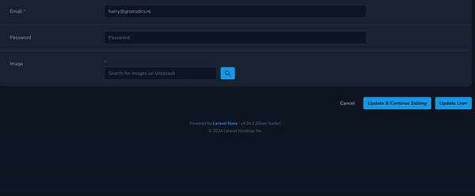

# Laravel Nova Unsplash Media Library

Laravel Nova Unsplash Media Library is a package that integrates Unsplash with Laravel Nova, enabling you to search and select images from Unsplash directly within your Nova resource. This package builds upon Spatie's Laravel Media Library for robust media handling.



## Installation
### Step 1: Get an Unsplash API Key
First, you need to obtain an Unsplash API key. Follow these steps:

1. Go to the Unsplash Developers page.
2. Sign up or log in to your Unsplash account.
3. Create a new application to get your API key.

### Step 2: Install Spatie Laravel Media Library
Follow the installation and setup guide for [Spatie's Laravel Media Library](https://spatie.be/docs/laravel-medialibrary/v11/installation-setup). 

### Step 3: Install Laravel Nova Unsplash Media Library
Install the Laravel Nova Unsplash Media Library package via Composer:

```
composer require gromatics/laravel-nova-unsplash-media-library
```

### Step 4: Publish Configuration (optional)
Publish the configuration file:

```
php artisan vendor:publish --provider="Gromatics\LaravelNovaUnsplashMediaLibrary\FieldServiceProvider"
```

### Step 5: Configure Unsplash API Key
Add your Unsplash API key to the .env file:

```
UNSPLASH_CLIENT_ID=your_unsplash_client_id
```

## Usage
### Step 1: Prepare Your Model
Ensure your model is set up to use the Spatie Media Library:

```
use Spatie\MediaLibrary\InteractsWithMedia;
use Spatie\MediaLibrary\HasMedia;
use Spatie\MediaLibrary\MediaCollections\Models\Media;
use Spatie\Image\Manipulations;

class YourModel extends Model implements HasMedia
{
use InteractsWithMedia;

    public function registerMediaConversions(Media $media = null): void
    {
        $this
            ->addMediaConversion('thumb')
            ->fit(Manipulations::FIT_CROP, 150, 150)
            ->nonQueued();
    }
}
```

## Step 2: Add UnsplashMediaLibrary to Your Nova Resource
Add the UnsplashMediaLibrary field to your Nova resource:

```
use YourName\LaravelNovaUnsplashMediaLibrary\UnsplashMediaLibrary;

class YourResource extends Resource
{
// Other resource methods...

    public function fields(Request $request)
    {
        return [
            ID::make()->sortable(),
            UnsplashMediaLibrary::make('Image'),
            // Other fields...
        ];
    }
}
```
### License
This package is open-sourced software licensed under the MIT license.

### Contributing
Contributions are welcome! Please open a new issue or submit a pull request.

### Support
For support or any questions, please open an issue on the GitHub repository.
